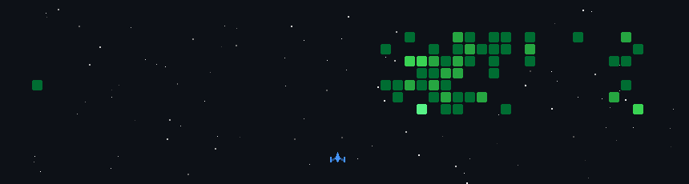

# Hello! I'm Yuriy, a Backend Developer 👋

  
  

  

<h3 align="left">Languages and Tools:</h3>

<table>
<tr>
    <td align="center" width="96">
        
       Java
    </td>
    <td align="center" width="96">
        
       Spring
    </td>
 <td align="center" width="96">
        
       Spring Boot
    </td>
  <td align="center" width="96">
        
       Hibernate
    </td>
  <td align="center" width="96">
        
      JUnit
    </td>
<td align="center" width="96">
        
       Mockito
    </td>
</tr>

 <tr>
 <td align="center" width="96">
        
       Maven
    </td>
    <td align="center" width="96">
        
       Tomcat
    </td>
    <td align="center" width="96">
        
       Github
    </td>
    <td align="center" width="96"> 
        
       Git
    </td>
    <td align="center" width="96">
        
       REST APIs
    </td>
    <td align="center" width="96">
        
       PostgreSQL
    </td>
 </tr>

 <tr>
      <td align="center" width="96">
        
       Postman
    </td>
      </td>
            <td align="center" width="96">
        
       Docker
    </td>
              <td align="center" width="96">
        
       Bash
    </td>
              <td align="center" width="96">
        
       Kubernetes
    </td>
    <td align="center" width="96">
        
       Linux
    </td>
    <td align="center" width="96">
        
     Nginx
 </tr>

</table>
  

